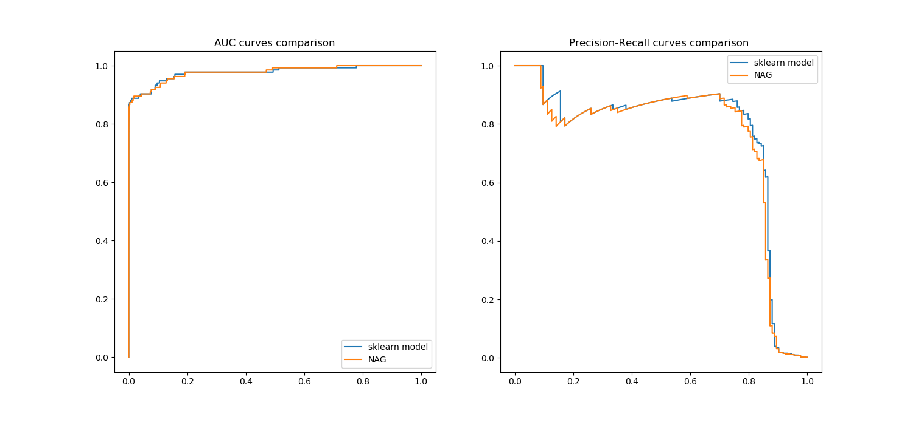

This repository implements Logistic Regression with Nesterov's Accelerated Gradient from scratch with NumPy.
The implemented algorithm provides identical classification performance to sklearn logistic regression function.

The dataset used for this demo is the Credit Card Fraud Detection dataset from Kaggle.
It is a difficult dataset due to high class imbalance, and more chances for the algorithm to oscillate / diverge.
This is avoided due to the look-ahead in Nesterov's method.

The EDA_FeatureSelection notebook shows how four features are selected for the final model. These features are used to demo the algorithm in Gradient_Descent.ipynb.

//todo: 1. code cleanup (np-pd switches can be avoided by reading X in np)
2. Cleanup driver code, add function call, allowing switch between SGD and NAG
3. Contour plots